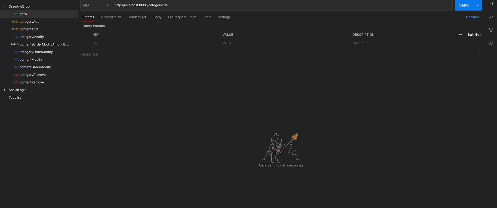
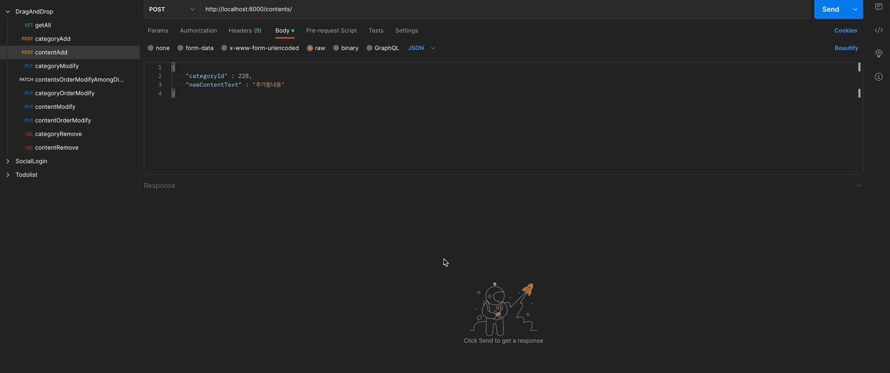
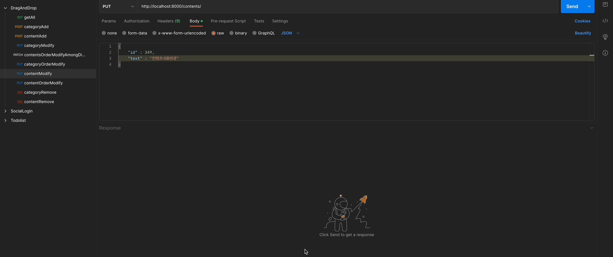
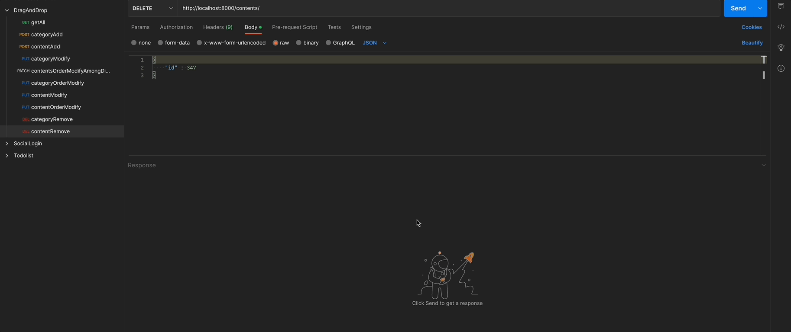
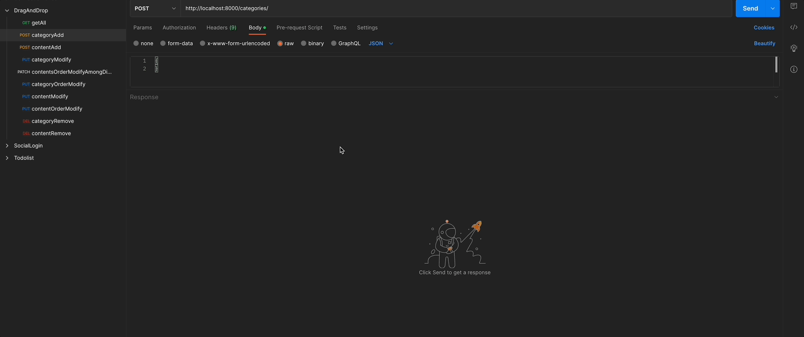
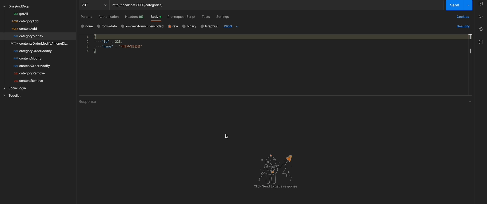
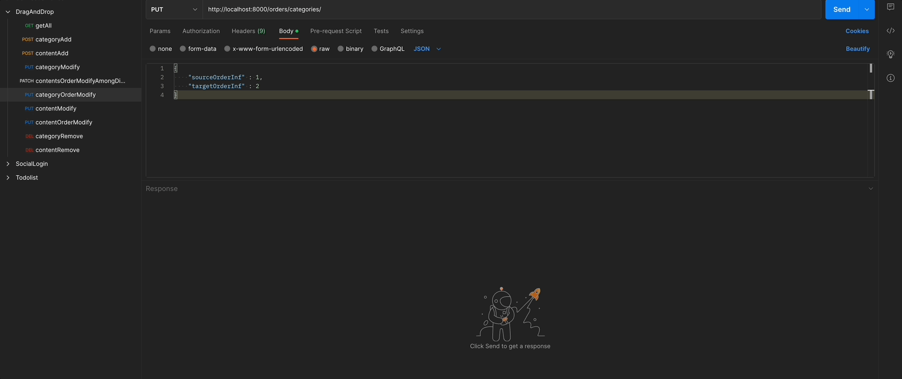
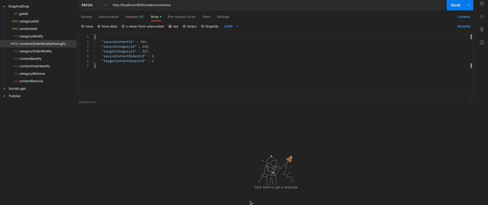

# draganddrop_backend(kr)

##### [Click here for English version](README_EN.md)

##### [日本語バージョンはこちらをクリックして下さい](README_JP.md)

## - 목차 -

1. 개요
2. 프로젝트목표
3. Postman API호출 시연
4. 차후구현예정기능
5. 개선필요내용
    
    

### 1. 개요

- 프로젝트명 : draganddrop_backend
- 기간 : 2023.02.20 - 2023. 03. 03(12일)
- 인원 : 1인
- 기술스택 :  
   
  
    
   
   

### 2. 프로젝트목표

1. DRAG & DROP을 통한 웹페이지 DOM 조작을 위한 CRUD API 제작
2. 프론트엔드서버와 연동 가능하도록 구현 할 것
3. Postman API 호출 테스트 기능을 사용 할 것
    
    

### 3. Postman API호출 시연  

1. 모든 contents 불러오기 
   
2. content 추가 
   
3. content 수정 
   
4. content 삭제 
   
5. content 순서변경 
   
6. category 추가 
   
7. category 수정 
   
8. category 삭제 
   
9. category 순서변경 
   
10. category간 content이동 
    
     
     

### 4. 차후구현예정기능

- QUERY TRANSACTION 구현 할 것
   
   

### 5. 개선필요내용

- DEADLOCK ERROR 원인 파악 후 수정 할 것
