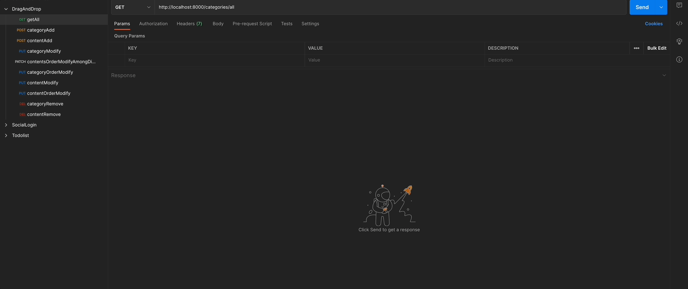
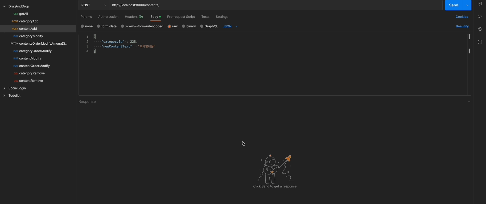
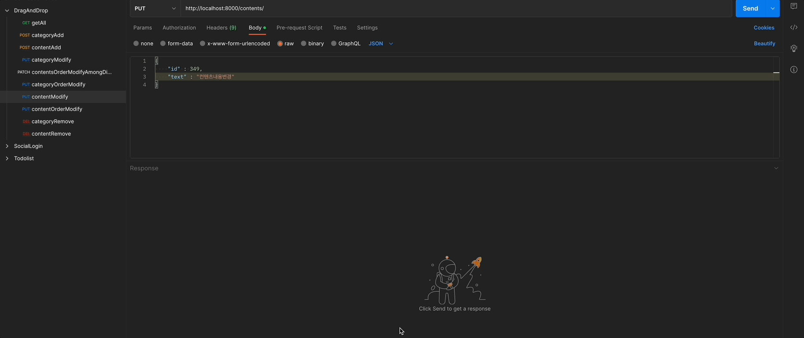
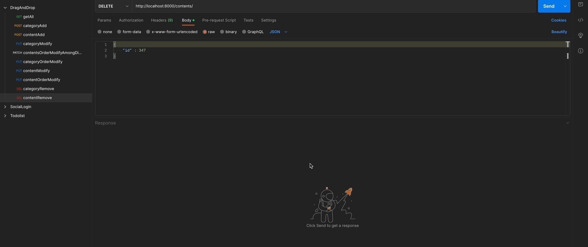
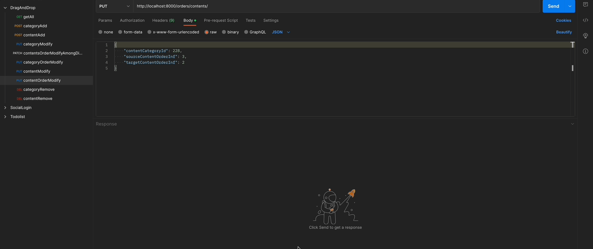
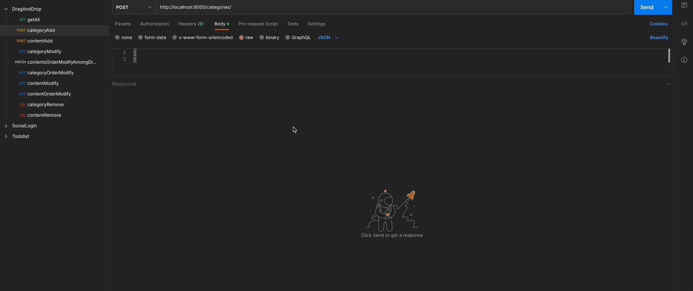
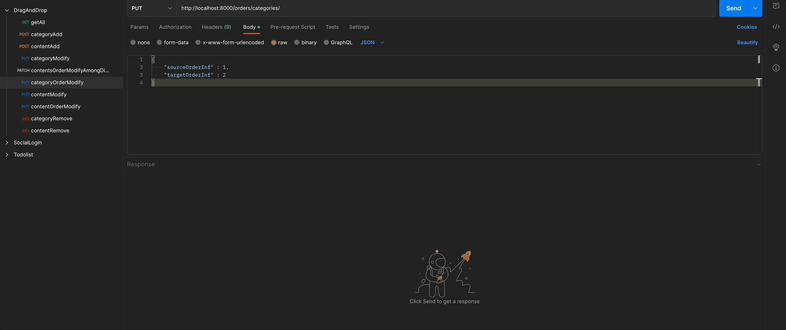

# draganddrop_backend(en)

##### [한국어 버전은 이 곳을 클릭해주세요](README.md)

##### [日本語バージョンはこちらをクリックして下さい](README_JP.md)

## - Index -

1. Overview
2. Project goal
3. Postman API request demo
4. Features for the next version
5. What needs to get fixed
    
    

### 1. Overview

- Project title : draganddrop_backend
- Period : 2023.02.20 - 2023. 03. 03(12days)
- Member(s) : Dug Park
- Tech stack :  
   
  
    
   
   

### 2. Project goal

1. Creating CRUD APIs to manipulate webpage's DOM with DRAG & DROP function
2. Have to able to interact with frontend server
3. Have to use Postman API request feature
    
    

### Postman API request demo  

1. Fetch all contents 
   
2. Add content 
   
3. Modify content 
   
4. Remove content 
   
5. Modify contents order 
   
6. category 추가 
   
7. Modify category 
   
8. Remove category 
   
9. Modify categories order 
   
10. Move content to other category 
    
     
     

### 4. Features for the next version

- Applying QUERY TRANSACTION
   
   

### 5. What needs to get fixed

- Finding out the reason of DEADLOCK ERROR and correct
